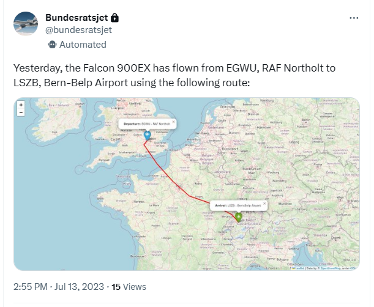

# Flight Tracker for Swiss Federal Council's Jets (BundesratsJets)

## Description

This Python project tracks the flights of the two jets owned by the Swiss Federal Council. Utilizing the ADSBExchange API, the program monitors the ICAO codes of the jets, logging their GPS coordinates when in flight, and compiling the data to generate comprehensive flight reports. These reports, including details like departure and arrival airports, are then shared on Twitter with a 24-hour delay in compliance with the latest Twitter rules. All the flight data is saved in an SQL database for historical analysis and backup.


*An example of a tweet generated by this project*

## Features

- **Plane Tracking**: Monitors geolocation and altitude changes to determine flight status.
- **Data Logging**: Records GPS coordinates of the jets when in flight and saves them in an SQL database.
- **Flight Report Generation**: Compiles flight reports upon landing, visualizing the flight path on a map.
- **Twitter Integration**: Automatically posts flight reports to Twitter with a 24-hour delay.

## How it Works

1. **Flight Detection**: Every 10 minutes, the program checks the altitude of the jets via the ADSBExchange API. An altitude change signifies a change in flight status.
2. **Data Logging**: While a jet is in the air, its GPS coordinates are logged every 10 minutes and saved to the SQL database.
3. **Flight Report Generation**: Upon landing, a flight report is generated. The flight path is visualized on a map and the departure and arrival airports are determined based on the GPS coordinates.
4. **Twitter Post**: The flight report, including the map visualization, is posted to Twitter via the Twitter API with a 24-hour delay.

## Prerequisites

Before you begin, ensure you have met the following requirements:

- Python 3.6 or later
- API keys for ADSBExchange and Twitter
- An SQL database setup to store the flight data

## Installation and Setup

1. **Clone the Repository**: `git clone https://github.com/elionick/BundesratsJet`
2. **Install Dependencies**: `pip install -r requirements.txt`
3. **Configure API Keys**: Add your ADSBExchange and Twitter API keys to the `.env` file.
4. **Setup Database**: Ensure your SQL database is setup and configure the connection in the configuration file.

## Usage

To start tracking flights, run the main script:

```bash
python main.py
```


## License

This project is licensed under the MIT License - see the [LICENSE.md](LICENSE.md) file for details.

## Contact

For any queries or to report an issue, please contact [bundesratsjet@eliohahn.ch](mailto:bundesratsjet@eliohahn.ch).

## Development Roadmap and Updates

### Upcoming Features
- Update to new Twitter API.
- Continuous performance and stability improvements.

### Version History

- **v1.7 (April 27, 2023)**: Improved Twitter output readability.
- **v1.6 (April 23, 2023)**: Successfully deployed to fly.io.
- *... (other versions) ...*
- **v0 (April 09, 2023)**: Initial setup and "Hello World".

